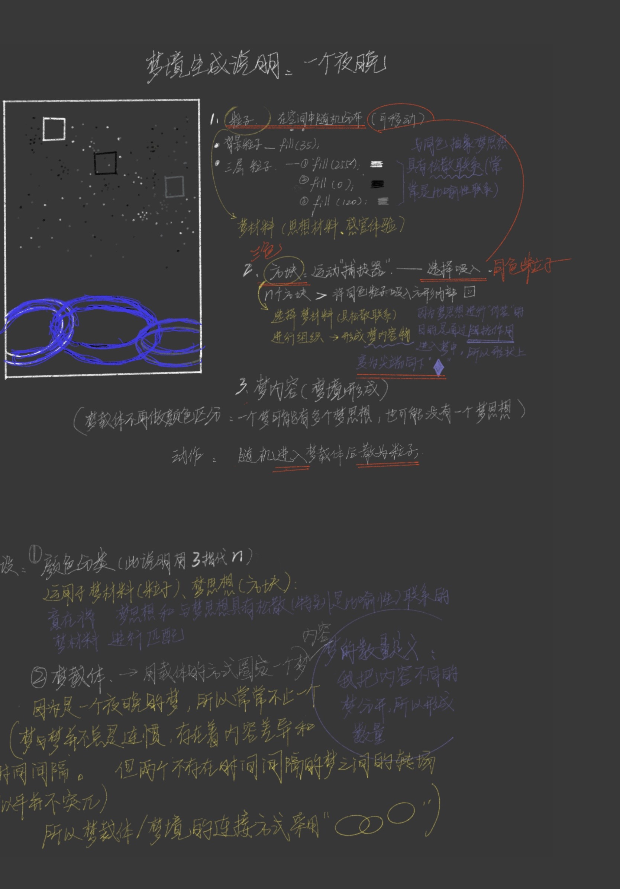

# 关于梦境生成的说明#
（第二版）

这是一份想象说明。

## 本次代码中包括：

- 三个母球—— 日常生活中产生的所有不易于直接表达的思想；范围较大
- 三个子球—— 梦思想；
- 方块—— 我们记忆及体验中直观具体的事件或物体；
- 三个与子球同色系的方块——与梦思想具有松散联系的事件（它们与梦思想的构成比喻性的联系，帮助梦思想通过阻抗作用进入梦境）；
- fill（60）的半透明椭圆框——梦境。 

增加：
在空间中加入了若干矩形和圆（鼠标操控）；
工作完成后 进入生成的梦境空间（之后可代入具体内容物梦境）。

### 注释： ###
梦思想即梦的隐义。 
梦的思想和梦的内容是两种语言对同一内容的两种描述（梦内容是用另一种表达方式来体现梦思想的翻译）。与梦思想的丰富性相比，梦的内容是贫乏的。

梦的内容并不围绕着梦思想中心的成分而排列，它常常与原文相脱离，变为某种异己的东西，进入梦境。因此联想通路从梦内容的成分（往往是容易忽略的细节）通向若干的梦思想。

### 说明书的第三版###
以上两版的视觉化尝试对于第三方来说并不能很直观的说明，缺少物体和表达内容的真正关联。
或者说我现在的能力还不足以把自己的想法通过这样一种比较陌生的工具顺利的表达出来。（想法转换经过的介质和干扰太多）

第三版会将生成过程进行更清楚说明，
图示

